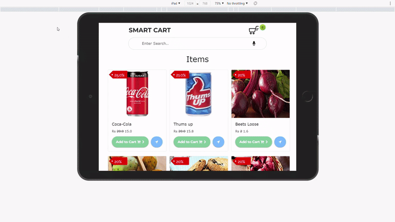
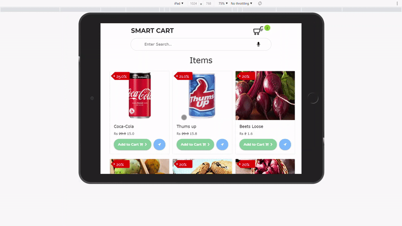

# Smart Cart

## SMART CART - An Hybrid shopping cart
Smart Cart is a hybrid shopping cart that improves customers' experience with the aid of providing more than one functionality in a cart so customers can purchase items contactless and hassle-free.

## Running the Project Locally

First, clone the repository to your local machine:

```bash
git clone https://github.com/gm185194/SmartCart
```

Install the requirements:

```bash
pip install -r requirements.txt
```

Apply the migrations:

```bash
python manage.py migrate
```

Collect the Static folder files:

```bash
python manage.py collectstatic
```

Finally, run the development server:

```bash
python manage.py runserver
```

# Some Snippets of the running project 

## ADVERTISEMENT


## SUGGESTIONS, DEALS & OFFERS



## VOICE ASSISTANCE


## In-Store Navigation



## ROBOTIC ARM


# Aditional Features

## ROBOTIC ARM
Beneficial with the covid situation and additionally if the object is at a great peak.

## IN-STORE NAVIGATION
Saves time for looking at any item inside the retail store. 
No need for any attendants to help in finding the products.

## MICRO-SERVICES
Everything in the smart cart is configurable, retail store can enable/disable the required functionalities accordingly. 
